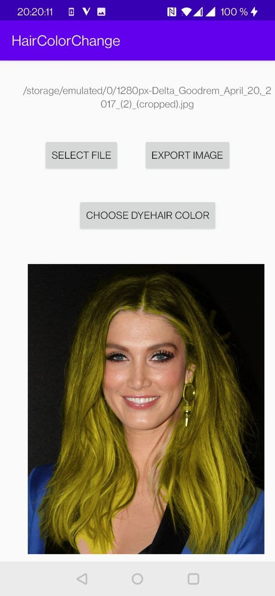
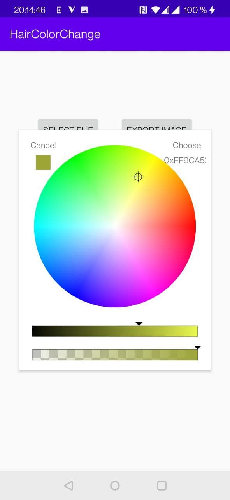
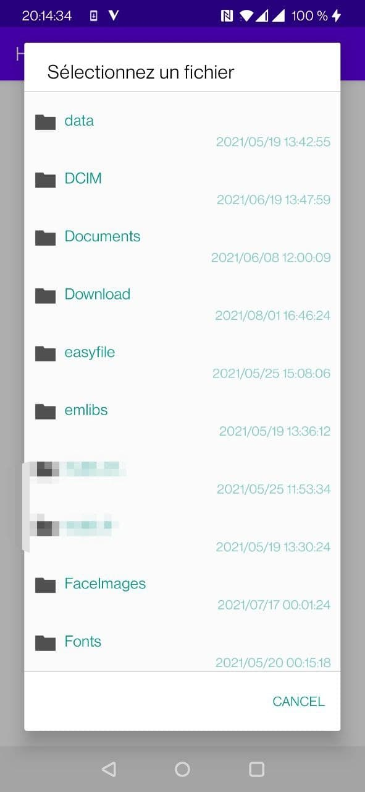

# CambiarPelo

> Call the hair segmentation AI SDK provided by [Fritz](https://www.fritz.ai/ "Fritz") to identify and colour the hair of a person in a given image.

### Here's the running screenshot of the software

